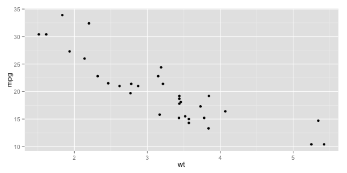

## Read-And-Delete

1. Edit YAML front matter
2. Write using R Markdown
3. Use an empty line followed by three dashes to separate slides!

--- .class #id 

## Slide 1

This is an animated list

> 1. Point 1
> 2. Point 2
> 3. Point 3

---

## ggplot2


```r
library(ggplot2)
qplot(wt, mpg, data = mtcars)
```

 


---

## Motion Chart

<!-- MotionChart generated in R 2.15.1 by googleVis 0.3.3 package -->
<!-- Tue Nov  6 22:42:28 2012 -->


<!-- jsHeader -->
<script type="text/javascript" src="http://www.google.com/jsapi">
</script>
<script type="text/javascript">
 
// jsData 
function gvisDataMotionChartIDcec234e81990 ()
{
  var data = new google.visualization.DataTable();
  var datajson =
[
 [
 "Apples",
2008,
"West",
98,
78,
20,
"2008-12-31" 
],
[
 "Apples",
2009,
"West",
111,
79,
32,
"2009-12-31" 
],
[
 "Apples",
2010,
"West",
89,
76,
13,
"2010-12-31" 
],
[
 "Oranges",
2008,
"East",
96,
81,
15,
"2008-12-31" 
],
[
 "Bananas",
2008,
"East",
85,
76,
9,
"2008-12-31" 
],
[
 "Oranges",
2009,
"East",
93,
80,
13,
"2009-12-31" 
],
[
 "Bananas",
2009,
"East",
94,
78,
16,
"2009-12-31" 
],
[
 "Oranges",
2010,
"East",
98,
91,
7,
"2010-12-31" 
],
[
 "Bananas",
2010,
"East",
81,
71,
10,
"2010-12-31" 
] 
];
data.addColumn('string','Fruit');
data.addColumn('number','Year');
data.addColumn('string','Location');
data.addColumn('number','Sales');
data.addColumn('number','Expenses');
data.addColumn('number','Profit');
data.addColumn('string','Date');
data.addRows(datajson);
return(data);
}
 
// jsDrawChart
function drawChartMotionChartIDcec234e81990() {
  var data = gvisDataMotionChartIDcec234e81990();
  var options = {};
options["width"] =    600;
options["height"] =    500;

     var chart = new google.visualization.MotionChart(
       document.getElementById('MotionChartIDcec234e81990')
     );
     chart.draw(data,options);
    

}
  
 
// jsDisplayChart 
function displayChartMotionChartIDcec234e81990()
{
  google.load("visualization", "1", { packages:["motionchart"] }); 
  google.setOnLoadCallback(drawChartMotionChartIDcec234e81990);
}
 
// jsChart 
displayChartMotionChartIDcec234e81990()
 
<!-- jsFooter -->  
//-->
</script>
 
<!-- divChart -->
  
<div id="MotionChartIDcec234e81990"
  style="width: 600px; height: 500px;">
</div>


